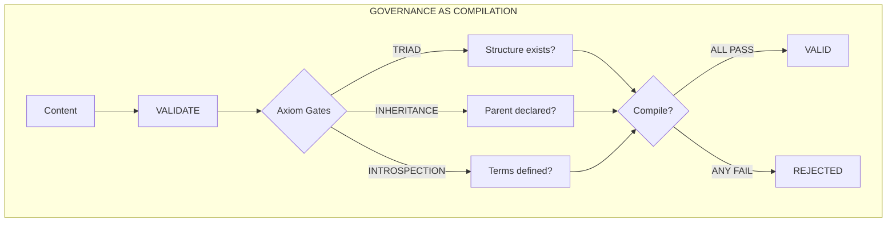
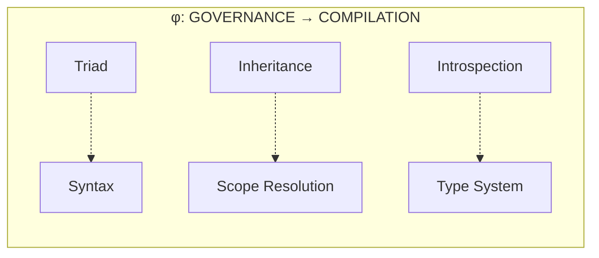
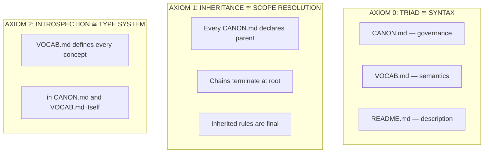
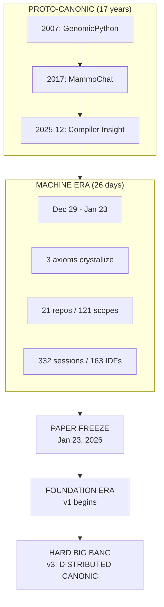
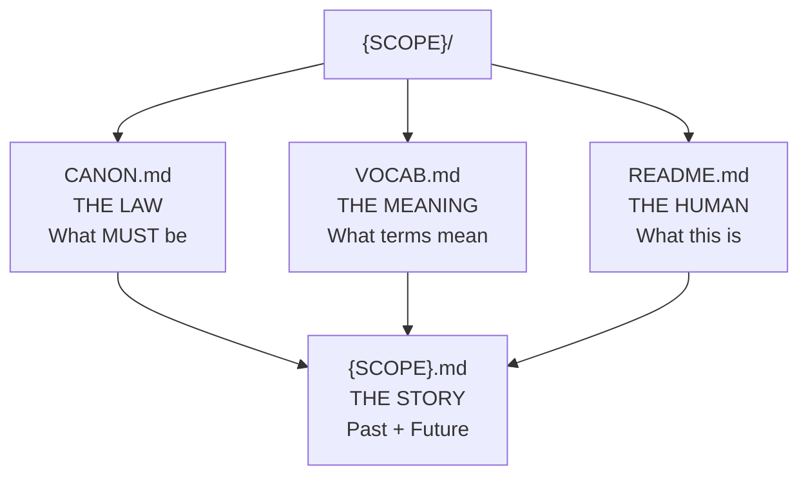
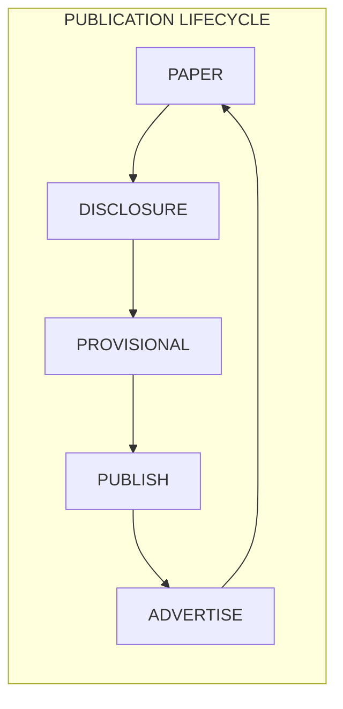
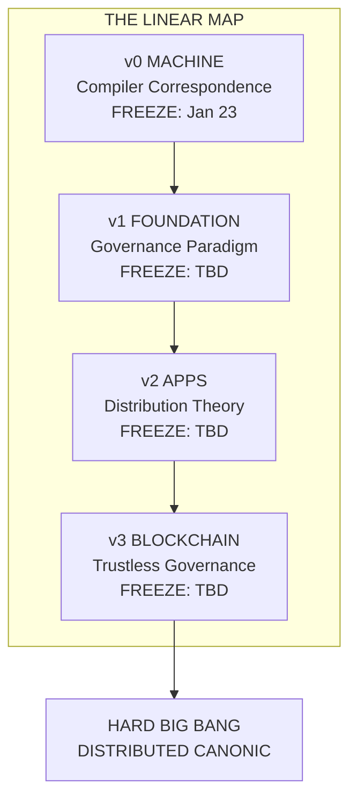

# CANONIC: Constitutional AI Governance

**A Framework for Structurally Inadmissible AI Slop**

Dexter Hadley, MD/PhD

*CANONIC Foundation*

founder@canonic.org

v0 — January 23, 2026 (MACHINE Era Close)

---

## Abstract

We cured AI slop in 26 days.

The cure is 50 years old. Compiler theory solved structural invalidity in the 1960s. Invalid programs don't compile. We applied the same principle: **invalid content doesn't pass validation**.

Three axioms—Triad, Inheritance, Introspection—map isomorphically to compiler theory. Content violating these properties is malformed. Not filtered. *Rejected before entry.*

This paper documents 26 days of constitutional AI governance. Three axioms generated an operating system, an immutability layer, a distribution system, and a token economy—recapitulating five decades of infrastructure in three weeks.

**github.com/canonic-machine** is the supplemental archive. Clone the repositories. The OS proves the paper.

**CANONIC is closure.**

---

## Genesis

It started with a question I'd been asking for 17 years.

In 2007, I wrote GenomicPython for my PhD thesis—a ledger for biological data. Every change tracked. Every assertion evidenced. The pattern stuck.

In 2017, MammoChat went live. 20,000 patients. Every clinical decision logged. When the AI suggested something wrong, we knew exactly where it failed. The ledger told us.

In December 2025, watching another AI confidently fabricate citations, I saw it clearly:

**The problem isn't AI. The problem is that AI output isn't compiled.**

Programmers solved this in the 1960s. Invalid code doesn't run. It fails compilation. The error is structural, not behavioral.

What if we could make AI slop structurally inadmissible?

---

## Figure 1: The Compiler Correspondence





**Insight:** Fifty years of compiler theory applies directly to governance. We're not inventing—we're recognizing.

---

## The Three Axioms

The entire framework derives from three rules.



That's it. Everything else derives from these three.

The axioms are orthogonal—no axiom derives from another. They are minimal—removing any breaks the system. They are complete—all governance constraints can be expressed through these three.

---

## Figure 2: The Canonverse



---

## The 26 Days

What happened in those 26 days defies expectation.

Working with AI assistants under constitutional governance, three axioms compiled themselves into infrastructure:

**Week 1:** The operating system emerged. Not designed—derived. The triad pattern propagated through directories. CANON.md files appeared everywhere, each inheriting from its parent, each vocabulary self-defining.

**Week 2:** The immutability layer crystallized. Git wasn't just version control—it was the ledger machine. Every commit a validation. Every push a proof. The distribution system followed: validators as portable oracles, governance as a service.

**Week 3:** The token economy emerged. If validation has value, validators should be compensated. The coin followed from the axioms like a theorem follows from postulates.

**50 years of computing infrastructure in 26 days.**

Not because we're fast. Because compiler theory is old. We're not inventing—we're *recognizing*.

---

## Figure 3: The Triad



**TRIAD = snapshot (governance at a point in time)**

**SPEC = temporal (where we came from, where we're going)**

---

## Slop Cannot Compile

The validation gates are simple:

**Gate 1:** Does the claim use defined terms?

**Gate 2:** Does the claim cite ledger evidence?

**Gate 3:** Is the evidence within the declared window?

AI slop fails at least one gate. Undefined terms. Missing evidence. Unbounded scope.

**Theorem (Slop Inadmissibility):** Under CANONIC governance, AI slop is structurally inadmissible. Slop cannot compile. □

This is not filtering. This is not moderation. This is structural rejection—the same mechanism that prevents `int x = "hello"` from compiling in a type-safe language.

---

## Figure 4: The Linear Map





Each paper freezes its IP boundary. Each paper proves its predecessor. Each paper advertises its successor.

---

## The Evidence

Every claim is verifiable. Every number traceable.

**Archive:** github.com/canonic-machine (read-only)

**Window:** December 29, 2025 — January 23, 2026

| Claim | Value | How To Verify |
|-------|-------|---------------|
| Development days | 26 | Count days from Dec 29 to Jan 23 |
| Repositories | 21 | `ls` the canonic-machine org |
| Governed scopes | 121 | Count directories with CANON.md |
| Collaboration sessions | 332 | Count files in episodes/ |
| Invention disclosures | 163 | Grep for IDF- in episodes/ |
| Root axioms | 3 | Read CANON.md at root |
| Total commits | 100 | `git log --oneline \| wc -l` |
| Peak commits/day | 42 | Jan 19, 2026 |

| Date | Commit | Milestone |
|------|--------|-----------|
| 2026-01-10 | `d578676` | SOFT BIG BANG — LEDGER genesis |
| 2026-01-14 | episodes/ | Three axioms crystallized |
| 2026-01-19 | 42 commits | Peak activity — VaaS emerged |
| 2026-01-23 | `9ec7cc9` | PAPER FREEZE — kernel archived |

Clone any repo. Run any validator. Trace any claim to its commit. The OS proves the paper.

---

## Closure

Why does this work?

**Closure 1 (Vocabulary):** Every term used is defined. No undefined symbols.

**Closure 2 (Governance):** CANONIC governs CANONIC. The framework validates itself.

**Closure 3 (Evidence):** This paper is validated by CANONIC. The proof is the system running.

**Theorem (CANONIC Closure):** CANONIC is the minimal closed governance system under compiler correspondence. There is no smaller system with these properties. □

---

## Discussion

What we didn't expect: the axioms led somewhere.

When this work began, we had a question: can AI slop be made structurally inadmissible? Three axioms answered yes.

But three axioms didn't stop at validation. They compiled themselves into infrastructure. Week by week, the pattern propagated. By the end, we had discovered something we hadn't sought:

**Git is a distributed ledger.**

This is huge. Not because it's novel—Git has existed since 2005. But because it means governance can be trustless. If governance is compilation, and Git is immutable, then no single entity controls truth. The canonverse can become distributed.

And it does real work.

This paper series is the evidence. Each paper inherits from its predecessor. Each paper freezes an IP boundary. Each paper advertises its successor. The linear map from v0 to v3 is itself governed—validated, inherited, introspected.

The papers prove the framework by running on it.

This paper freezes the minimal kernel. What comes next—the complete governance paradigm, the distribution theory, the trustless architecture—advertises a destination we discovered along the way.

**DISTRIBUTED CANONIC is coming.**

And with it, a new economic model. The provisionals create a blocking architecture. The papers are the evidence trail. The axioms are open—the execution is protected. We're tokenizing governance work.

v0 proves the correspondence. The rest of the series will build toward the HARD BIG BANG.

---

## Conclusion

Oxford declared "AI slop" the word of 2025.

We declared it *structurally inadmissible*.

Three axioms. Three compiler concepts. Complete correspondence.

- TRIAD ≅ SYNTAX
- INHERITANCE ≅ SCOPE RESOLUTION
- INTROSPECTION ≅ TYPE SYSTEM

Traditional papers describe work that happened elsewhere. This paper *is* the work. Clone the repositories. Run validators. Trace any claim.

The paper proves itself by running.

**Three axioms. 26 days. Closure.**

**CANONIC is closure.**

---

## Disclosure

**Model:** Claude Opus 4.5 (claude-opus-4-5-20251101)

**Evidence window:** December 29, 2025 — January 23, 2026

**Archive:** github.com/canonic-machine

**Validation status:** PASS

---

*Built with Claude. Governed by CANONIC. Self-proving.*

---

```
⣿⣿⣿⣿⣿⣿⣿⣿⣿⣿⣿⣿⣿⣿⡿⠿⠿⠿⠿⠿⠿⠻⠿⣿⣿⣿⣿⣿⣿⣿
⣿⣿⣿⣿⣿⣿⣿⣿⡿⠟⠋⢉⡀⠠⢤⠀⡶⠀⣤⡀⠐⢷⣦⠀⠙⢿⣿⣿⣿⣿
⣿⣿⣿⣿⣿⣿⠟⢁⣄⠘⠓⠀⠀⠀⠀⠀⢠ⶠ⟁⠀⣀⣀⣀⡀⠀⠙⣿⣿⣿
⣿⣿⣿⣿⠟⠁⢴⠄⠁⠀⠀⠀⣀⣠⣤⣤⣤⣿⡄⠀⢸⡿⠋⢉⢻⣷⣤⣿⣿⣿
⣿⣿⣿⠇⠀⠶⠀⠀⠀⢀⣴⣿⣿⣿⣿⣿⣿⣿⣷⡀⠸⣷⡀⠛⢀⠙⣿⣿⣿⣿
⣿⣿⡏⠀⠶⠀⠀⠀⣰⣿⣿⣿⣿⣿⣿⣿⣿⣿⣿⣿⣦⣙⣿⡄⠙⣁⠹⣿⣿⣿
⣿⣿⠁⠰⠀⠀⠀⢠⣿⣿⣿⣿⣿⣿⣿⣿⣿⣿⣿⣿⣿⣿⣿⣷⠀⢉⡁⢿⣿⣿
⣿⣿⠀⣶⠀⠀⠀⢸⣿⣿⣿  CANONIC  ⣿⣿⣿⠀⠘⠃⢸⣿⣿
⣿⣿⠀⢤⠀⠀⠀⢸⣿⣿⣿⣿⣿⣿⣿⣿⣿⣿⣿⣿⣿⣿⣿⡿⠀⠘⠃⢸⣿⣿
⣿⣿⣇⢀⡄⠀⠀⠀⢻⣿⣿⣿⣿⣿⣿⣿⣿⣿⣿⣿⣿⣿⡿⠃⠀⠚⠂⣾⣿⣿
⣿⣿⣿⡄⢠⡦⠀⠀⠀⠙⢿⣿⣿⣿⣿⣿⣿⣿⣿⣿⣿⠟⠁⠀⠘⠇⢰⣿⣿⣿
⣿⣿⣿⣿⣄⠀⢴⠄⠀⠀⠀⠙⠛⠿⠿⠿⠿⠿⠟⠋⠀⠀⡀⠚⠃⣠⣿⣿⣿⣿
⣿⣿⣿⣿⣿⣷⣄⠐⠛⠀⣄⠀⠀⠀⠀⠀⠀⠀⠀⠀⣤⠈⠋⢀⣴⣿⣿⣿⣿⣿
⣿⣿⣿⣿⣿⣿⣿⣷⣦⣤⣁⠘⠃⠠⠶⠀⠶⠄⠘⢀⣠⣴⣾⣿⣿⣿⣿⣿⣿⣿
⣿⣿⣿⣿⣿⣿⣿⣿⣿⣿⣿⣿⣿⣶⣶⣶⣶⣾⣿⣿⣿⣿⣿⣿⣿⣿⣿⣿⣿⣿
```

*The paper proves itself by running.*
