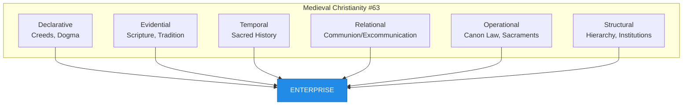
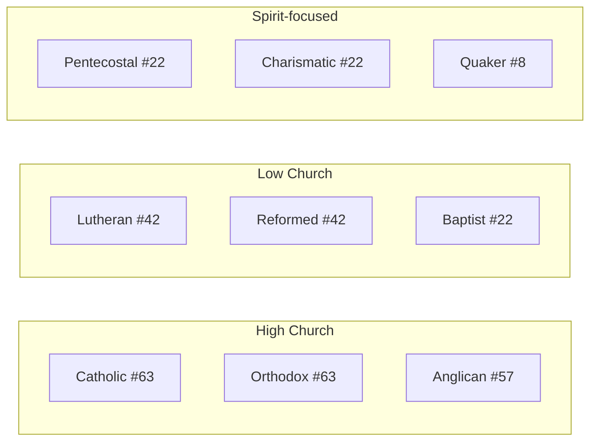

# The Evolution of Christianity: A Lattice-Theoretic Analysis

**Modeling Religious Development Through Governance Primitives**

January 2026

---

## Abstract

We present a formal analysis of Christianity's 2,000-year evolution using the CANONIC lattice framework. By mapping religious development to six governance primitives—Declarative, Evidential, Temporal, Relational, Operational, and Structural—we reveal that Christianity's historical phases correspond to predictable lattice transitions. The framework demonstrates that schisms are formula disagreements, orthodoxy represents shared minimum primitives, and the Protestant Reformation constitutes a subtraction operation on the lattice. This analysis provides a novel lens for understanding religious evolution as a governance phenomenon rather than purely theological or sociological.

---

## 1. Introduction

Christianity is the world's largest religion, with approximately 2.4 billion adherents across thousands of denominations. Its evolution from a Jewish messianic movement in 1st-century Palestine to a global institution spans two millennia of theological development, political transformation, and institutional change.

Traditional analyses of Christian history emphasize theological disputes (Christology, soteriology), political factors (Constantine, Reformation princes), or sociological dynamics (urbanization, literacy). These frameworks illuminate different aspects but lack formal structure for comparison.

We propose an alternative: Christianity as a governance system. Religious movements make claims (Declarative), cite evidence (Evidential), track history (Temporal), define boundaries (Relational), enforce norms (Operational), and build institutions (Structural). These six primitives—the CANONIC Hexad—provide a formal framework for analyzing religious evolution.

The insight: **religious development is lattice navigation.**

Each phase of Christianity can be characterized by which primitives are active. Transitions between phases correspond to adding or subtracting primitives. Schisms occur when groups disagree about which primitives are essential.

---

## 2. The Hexad Framework

The CANONIC language defines six governance primitives:

| Primitive | Symbol | Function | Religious Analog |
|-----------|--------|----------|------------------|
| Declarative | D | Assertions of truth | Creeds, confessions, dogma |
| Evidential | E | Proof and testimony | Scripture, tradition, miracles |
| Temporal | T | Time-ordering | Sacred history, liturgical calendar |
| Relational | R | Boundaries | Communion, excommunication, jurisdiction |
| Operational | O | Enforcement | Canon law, sacraments, discipline |
| Structural | S | Institutional form | Hierarchy, councils, buildings |

These primitives combine into 2^6 = 64 possible configurations, numbered 0-63. The empty set (no primitives) is #0. The full set (all primitives) is #63, called ENTERPRISE.

### Key Formulas

| Formula | Primitives | Number | Description |
|---------|------------|--------|-------------|
| D | Declarative only | #1 | Pure claim |
| D∩T | Declarative + Temporal | #8 | Dated claim |
| D∩E∩T | + Evidential | #22 | Proven dated claim |
| D∩E∩T∩R | + Relational | #42 | Bounded proven claim |
| D∩E∩T∩R∩O | + Operational | #57 | Enforced bounded claim |
| D∩E∩T∩R∩O∩S | + Structural | #63 | Full enterprise |

---

## 3. Phase Analysis

### 3.1 Kerygma Phase (30-50 CE)

**Formula: D∩T (#8)**

The earliest Christianity was oral proclamation (*kerygma* = "preaching"). The apostles made claims about Jesus—his life, death, resurrection, and return—dated to their own witness.

**Primitives present:**
- **Declarative**: "Jesus is Lord" (Romans 10:9)
- **Temporal**: "in these last days" (Hebrews 1:2), eyewitness testimony

**Primitives absent:**
- No written evidence yet (Evidential)
- No formal boundaries (Relational)—still within Judaism
- No enforcement mechanism (Operational)
- No institutional structure (Structural)

The movement was defined by what it *claimed* and *when*, nothing more.

### 3.2 Apostolic Phase (50-100 CE)

**Formula: D∩E∩T (#22)**

The transition to writing created evidence. Paul's letters (50s CE), the Gospels (70-100 CE), and other texts provided permanent records of claims.

**Addition: Evidential**
- Written texts cite earlier witnesses
- Letters reference prior teachings
- Gospels cite Old Testament prophecy

The formula D∩E∩T is significant: **claims + evidence + time**. This is the minimal configuration for verifiable knowledge. Christianity became documentable.

```
Kerygma (D∩T) + Writing → Apostolic (D∩E∩T)
         #8    + E      →           #22
```

### 3.3 Patristic Phase (100-325 CE)

**Formula: D∩E∩T∩R (#42)**

The post-apostolic period introduced boundaries. As diverse interpretations emerged (Gnosticism, Marcionism, Montanism), the proto-orthodox movement defined who was *in* and who was *out*.

**Addition: Relational**
- Canon formation: which books are authoritative
- Apostolic succession: which bishops are legitimate
- Creedal formulas: which beliefs are required
- Excommunication: formal boundary exclusion

The Relational primitive creates **orthodoxy** and **heresy**. Before boundaries, there were only different views. After boundaries, there were correct views and incorrect views.

```
Apostolic (D∩E∩T) + Boundaries → Patristic (D∩E∩T∩R)
           #22    + R          →           #42
```

### 3.4 Imperial Phase (325-476 CE)

**Formula: D∩E∩T∩R∩O (#57)**

Constantine's legalization of Christianity (313 CE) and the Council of Nicaea (325 CE) introduced enforcement. The state backed doctrinal decisions.

**Addition: Operational**
- Imperial enforcement of council decisions
- Exile of heretics (Arius)
- Legal privileges for orthodox Christians
- Penalties for deviation

The Council of Nicaea exemplifies the transition:

| Pre-Nicaea | Post-Nicaea |
|------------|-------------|
| Arianism is one view among many | Arianism is anathema |
| Debate continues | Debate is settled |
| No penalty for Arian belief | Exile for Arian bishops |

The formula D∩E∩T∩R∩O (#57) is called **PATENT** in CANONIC—a claim with evidence, time, boundaries, and enforcement. Imperial Christianity was "patented" orthodoxy.

```
Patristic (D∩E∩T∩R) + State power → Imperial (D∩E∩T∩R∩O)
           #42      + O           →          #57
```

### 3.5 Medieval Phase (476-1517 CE)

**Formula: D∩E∩T∩R∩O∩S (#63)**

The fall of Rome left the Church as the primary institutional continuity in Western Europe. Christianity developed full structural complexity:

**Addition: Structural**
- Elaborate hierarchy (Pope, cardinals, archbishops, bishops, priests)
- Monastic orders with detailed rules
- Canon law as comprehensive legal system
- Liturgical uniformity (Latin Mass)
- Physical infrastructure (cathedrals, monasteries)
- Educational institutions (universities)

The formula D∩E∩T∩R∩O∩S (#63) is **ENTERPRISE**—the maximum governance configuration. Medieval Christendom was a complete civilization.



---

## 4. The Reformation as Subtraction

### 4.1 Luther's Challenge

Martin Luther's 95 Theses (1517) attacked specific practices (indulgences) but implied a deeper challenge: **which primitives are essential?**

Luther's *sola scriptura* (Scripture alone) and *sola fide* (faith alone) implicitly rejected:
- **Operational**: Papal authority, priestly mediation
- **Structural**: Hierarchical necessity, institutional sacraments

The Protestant formula: **D∩E∩T (#22)**—the same as the Apostolic phase.

```
Medieval (D∩E∩T∩R∩O∩S) - Institutional mediation → Protestant (D∩E∩T)
         #63           - O - S                    →           #22
```

### 4.2 Formula Disagreement

The Reformation was not merely theological—it was a lattice disagreement:

| Tradition | Formula | Essential Primitives |
|-----------|---------|---------------------|
| Catholic | #63 | All six |
| Orthodox | #63 | All six (different structure) |
| Protestant | #22 | D, E, T only |
| Radical Reformation | #8 | D, T only (Spirit over Scripture) |

Each tradition answers differently: **What is necessary for Christianity?**

- Catholics: Complete structure is necessary
- Orthodox: Complete structure is necessary (but papal structure is wrong)
- Protestants: Scripture and faith are sufficient
- Radicals: Spirit and confession are sufficient

### 4.3 The Wars of Religion

The period 1517-1648 saw Europe torn by religious wars. The Peace of Westphalia (1648) established *cuius regio, eius religio* (whose realm, his religion)—a **purely Relational** solution.

```
Formula: R (#4)

The settlement did not resolve:
- Which claims are true (D)
- Which evidence is valid (E)
- Which history is authoritative (T)
- Which enforcement is legitimate (O)
- Which structure is correct (S)

It only resolved:
- Which boundaries apply where (R)
```

Westphalia is Formula #4—Relational only. This minimal formula allowed coexistence by abandoning agreement on everything except territory.

---

## 5. Modern Differentiation

### 5.1 The Tradition Spectrum

Post-Reformation Christianity exhibits multiple formulas:



| Tradition | Formula | Distinguishing Feature |
|-----------|---------|----------------------|
| Roman Catholic | D∩E∩T∩R∩O∩S (#63) | Papal structure |
| Eastern Orthodox | D∩E∩T∩R∩O∩S (#63) | Conciliar structure |
| Anglican | D∩E∩T∩R∩O (#57) | Episcopal without papal |
| Lutheran | D∩E∩T∩R (#42) | Confessional boundaries |
| Reformed | D∩E∩T∩R (#42) | Covenantal boundaries |
| Baptist | D∩E∩T (#22) | Believer's baptism as evidence |
| Pentecostal | D∩E∩T (#22) | Spirit gifts as evidence |
| Quaker | D∩T (#8) | Inner Light, no sacraments |

### 5.2 Ecumenical Movements

20th-century ecumenism sought Christian unity. In lattice terms, ecumenism asks: **What is the minimum shared formula?**

The World Council of Churches (1948) defined membership as churches that "confess the Lord Jesus Christ as God and Savior." This is essentially Formula D (#1)—pure Declarative.

```
Ecumenical minimum = D (#1)
All Christians share = "Jesus is Lord"
```

Deeper ecumenism requires expanding the shared formula:
- D∩E: Agreement on Scripture
- D∩E∩T: Agreement on Nicaea/Chalcedon
- D∩E∩T∩R: Mutual recognition of baptism
- Beyond: Increasingly difficult

---

## 6. Formal Properties

### 6.1 Schism as Formula Split

Every major schism corresponds to disagreement about primitives:

| Schism | Date | Issue | Formula Split |
|--------|------|-------|---------------|
| Gnostic | 2nd c. | Nature of evidence | E disagreement |
| Donatist | 4th c. | Validity of sacraments | O disagreement |
| East-West | 1054 | Papal authority | S disagreement |
| Protestant | 1517 | Scripture vs. tradition | E, O, S disagreement |
| Old Catholic | 1870 | Papal infallibility | O, S disagreement |

**Theorem (Schism Structure):** A schism occurs when groups assign different essentiality to primitives.

### 6.2 Orthodoxy as Minimum

Orthodoxy represents the **agreed minimum formula** within a communion.

For global Christianity, the minimum is approximately:
- **D**: Jesus is Lord, died, rose
- **E**: Scripture is authoritative
- **T**: Events happened in history

This yields D∩E∩T (#22)—the Apostolic formula. Traditions diverge by what they *add* to this minimum.

### 6.3 Heresy as D-Rejection

In CANONIC terms: **Heresy = D rejected by R**

A heresy is not merely wrong (E-failure) but boundary-excluded (R-decision). The same belief can be heterodox in one period and tolerable in another, depending on Relational decisions.

Example: Subordinationism (Son subordinate to Father)
- Pre-Nicaea: One view among several
- Post-Nicaea: Heresy (Arianism condemned)
- Modern: Some evangelicals hold soft versions

The belief didn't change; the boundary (R) did.

---

## 7. Predictive Power

The lattice framework makes predictions:

### 7.1 New movements start low

New Christian movements typically begin with minimal formulas and add primitives over time:

| Movement | Initial | Current |
|----------|---------|---------|
| Methodism (1738) | D∩E∩T | D∩E∩T∩R∩O∩S |
| Pentecostalism (1901) | D∩E∩T | D∩E∩T∩R (some) |
| House Church (1970s) | D∩E∩T | varies |

**Prediction:** Movements that survive long-term will accumulate primitives.

### 7.2 Decline involves subtraction

Declining institutions often lose primitives:

| Trajectory | Pattern |
|------------|---------|
| Mainline Protestant decline | O weakening, S shrinking |
| "Spiritual but not religious" | R, O, S rejected |
| Cultural Christianity | D weakening, E ignored |

**Prediction:** Loss of Operational and Structural primitives precedes institutional decline.

### 7.3 Conflict intensity correlates with formula distance

The "distance" between formulas predicts conflict intensity:

| Pair | Formula Distance | Historical Conflict |
|------|-----------------|---------------------|
| Catholic-Orthodox | 0 | Low (same formula, different S content) |
| Catholic-Anglican | 1 | Moderate |
| Catholic-Baptist | 3 | High |
| Christian-Secular | 6 | Maximum |

**Prediction:** Ecumenical success is inversely proportional to formula distance.

---

## 8. Discussion

### 8.1 Reductionism Objection

Critics may object that reducing Christianity to six primitives ignores theological content. This misunderstands the framework.

The lattice describes *governance structure*, not *belief content*. Two groups can share Formula #63 while disagreeing about everything substantive (Catholic vs. Orthodox). The framework analyzes *how* beliefs are held, not *what* is believed.

### 8.2 Historical Contingency

The phase progression (D∩T → D∩E∩T → ... → #63) is not inevitable. Christianity could have stabilized at any phase. The progression reflects contingent historical factors:

- Writing technology enabled E
- Diversity crisis enabled R
- Constantine enabled O
- Rome's fall enabled S

Alternative histories might yield different trajectories.

### 8.3 Comparative Application

The framework applies beyond Christianity:

| Religion | Typical Formula | Notes |
|----------|-----------------|-------|
| Islam | D∩E∩T∩R∩O∩S (#63) | Full enterprise |
| Judaism | D∩E∩T∩R∩O (#57) | Strong O, variable S |
| Buddhism | D∩E∩T∩R∩S (#46) | Weak O in some traditions |
| Hinduism | D∩E∩T∩S (#27) | Weak R and O |
| New Age | D∩T (#8) | Minimal structure |

Comparative religion becomes comparative lattice analysis.

---

## 9. Conclusion

Christianity's 2,000-year evolution follows a lattice trajectory:

```
D∩T → D∩E∩T → D∩E∩T∩R → D∩E∩T∩R∩O → D∩E∩T∩R∩O∩S
#8  →  #22   →   #42    →    #57     →     #63

Kerygma → Apostolic → Patristic → Imperial → Medieval
```

The Reformation was subtraction:

```
#63 → #22 (Protestant mainstream)
#63 → #8  (Radical Reformation)
```

Modern Christianity is lattice pluralism—multiple formulas coexisting, with ecumenism seeking minimum overlap.

This framework offers:
1. **Formal precision**: Phases have numerical identity
2. **Predictive power**: Trajectories follow patterns
3. **Comparative scope**: Applies across traditions
4. **Explanatory clarity**: Schisms are formula splits

Christianity is not merely a set of beliefs but a governance system. Its evolution is lattice navigation. The framework makes this navigation visible.

---

## References

### Primary Sources

[1] New Testament. Various authors, c. 50-100 CE.

[2] Eusebius of Caesarea. *Church History*. c. 324 CE.

[3] Athanasius. *On the Incarnation*. c. 318 CE.

[4] Council of Nicaea. *Nicene Creed*. 325 CE.

[5] Augustine. *City of God*. 426 CE.

[6] Luther, Martin. *95 Theses*. 1517.

[7] Calvin, John. *Institutes of the Christian Religion*. 1536.

### Secondary Literature

[8] Pelikan, Jaroslav. *The Christian Tradition: A History of the Development of Doctrine*. 5 vols. University of Chicago Press, 1971-1989.

[9] González, Justo. *The Story of Christianity*. 2 vols. HarperOne, 2010.

[10] MacCulloch, Diarmaid. *Christianity: The First Three Thousand Years*. Viking, 2010.

[11] Chadwick, Henry. *The Early Church*. Penguin, 1993.

[12] McGrath, Alister. *Reformation Thought: An Introduction*. Wiley-Blackwell, 2012.

[13] Stark, Rodney. *The Rise of Christianity*. HarperOne, 1997.

### CANONIC Framework

[14] Hadley, D. (2026). CANONIC LANGUAGE Specification v0.1. github.com/canonic-machine/canonic.

[15] Hadley, D. (2026). CANONIC: Constitutional AI Governance. arXiv preprint.

---

## Appendix A: Complete Phase Table

| Phase | Period | Formula | # | D | E | T | R | O | S |
|-------|--------|---------|---|---|---|---|---|---|---|
| Kerygma | 30-50 | D∩T | 8 | + | - | + | - | - | - |
| Apostolic | 50-100 | D∩E∩T | 22 | + | + | + | - | - | - |
| Patristic | 100-325 | D∩E∩T∩R | 42 | + | + | + | + | - | - |
| Imperial | 325-476 | D∩E∩T∩R∩O | 57 | + | + | + | + | + | - |
| Medieval | 476-1517 | D∩E∩T∩R∩O∩S | 63 | + | + | + | + | + | + |
| Reformation | 1517+ | varies | - | + | ± | + | ± | ± | ± |

---

## Appendix B: Tradition Formulas

| Tradition | Formula | # | Key Distinguishing Feature |
|-----------|---------|---|---------------------------|
| Roman Catholic | D∩E∩T∩R∩O∩S | 63 | Papal supremacy, Magisterium |
| Eastern Orthodox | D∩E∩T∩R∩O∩S | 63 | Conciliar authority, theosis |
| Oriental Orthodox | D∩E∩T∩R∩O∩S | 63 | Miaphysitism |
| Anglican | D∩E∩T∩R∩O | 57 | Via media, episcopal polity |
| Lutheran | D∩E∩T∩R | 42 | Augsburg Confession |
| Reformed | D∩E∩T∩R | 42 | Westminster/Heidelberg |
| Methodist | D∩E∩T∩R∩O | 57 | Wesleyan quadrilateral |
| Baptist | D∩E∩T | 22 | Believer's baptism |
| Pentecostal | D∩E∩T | 22 | Spirit baptism |
| Quaker | D∩T | 8 | Inner Light |
| Unitarian | D | 1 | Reason over tradition |

---

## Appendix C: Council Decisions as Lattice Operations

| Council | Year | Decision | Lattice Operation |
|---------|------|----------|-------------------|
| Jerusalem | ~50 | Gentile inclusion | R expansion |
| Nicaea | 325 | Homoousios | R boundary + O enforcement |
| Constantinople | 381 | Spirit divinity | D addition |
| Ephesus | 431 | Theotokos | D addition, R (Nestorius) |
| Chalcedon | 451 | Two natures | D clarification, R (Monophysites) |
| Trent | 1545-63 | Counter-Reformation | O strengthening |
| Vatican I | 1870 | Papal infallibility | O + S modification |
| Vatican II | 1962-65 | Aggiornamento | S modification |

---

**Generated under CANONIC governance.**

**GitHub: canonic-machine/christianity**

